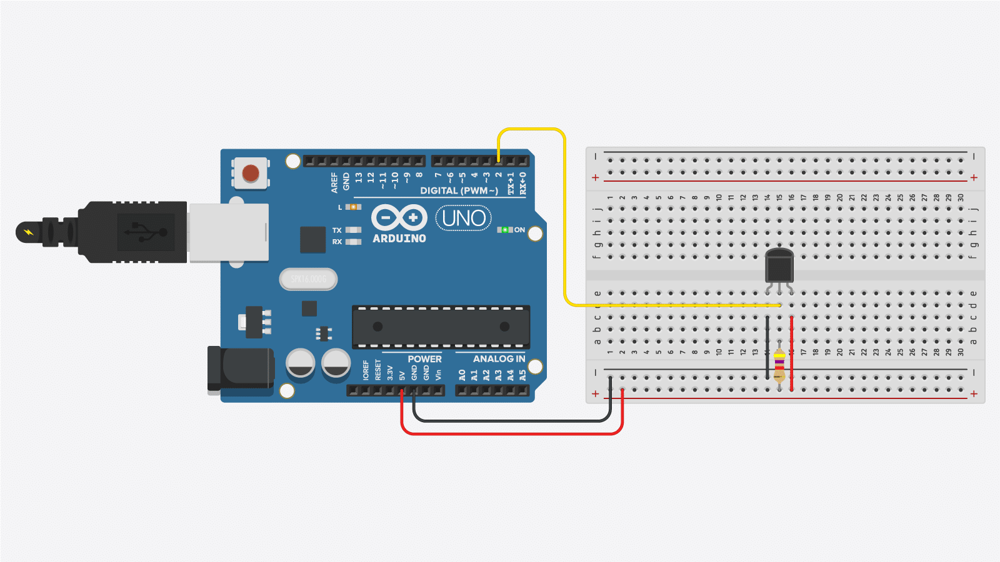
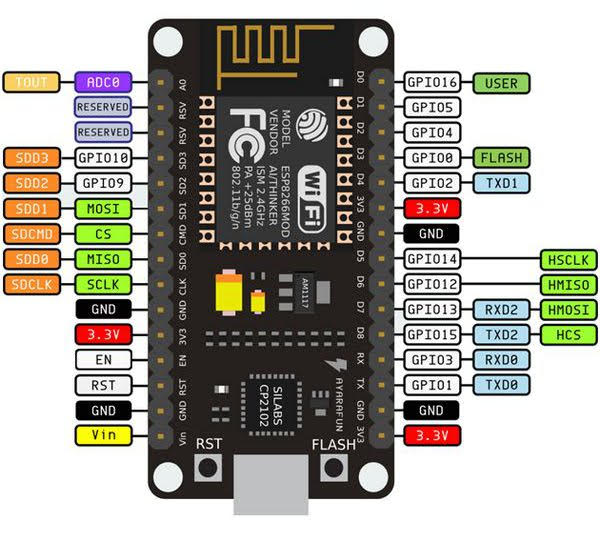

# Thermomètre de Piscine
Projet Arduino d'un thermomètre connecté pour surveiller la température de ma piscine à distance depuis un site internet.

## 1. Configuration du matériel :
### Branchement ESP --> thermomètre DS18B20 :
- Connecter le capteur DS18B20 à l'ESP8266 selon le schéma de câblage.



## 2.Programmation de l’ESP8266
### Récupérer une température sur l'ESP client :

- Écrire un programme Arduino pour lire la température du capteur DS18B20.
    ```
    #include "OneWire.h"
    #include "DallasTemperature.h"

    #define ONE_WIRE_BUS 4
    OneWire oneWire(ONE_WIRE_BUS);
    DallasTemperature sensors(&oneWire);

    void setup() {
    Serial.begin(115200);
    sensors.begin();
    delay(10);
    
    }

    void loop() {
    sensors.requestTemperatures();
    float temperature = sensors.getTempCByIndex(0);
    Serial.println(temperature);
    delay(5000);
    }
    ```

### Envoyer la température au serveur ESP :
Ajout des bibliothèques `ESP8266WiFi` et `WifiClient` pour permettre la connexion de l'ESP client au Wifi.

1. Création d'un fichier de configuration pour y stocker les informations de connexion telle que le SSID ou le password. 
    ```
    // config.h

    #define SSID "Livebox-4810"
    #define PASSWORD "7SypWJtqvaLHgYwHKV"
    ```
2. Modification du code client pour ajouter la configuration WiFi.
    ```
    // Bibliothèques Wifi
    #include <ESP8266WiFi.h>
    #include <WiFiClient.h>

    // Information de connexion
    #include "config.h"
    const char* serverESPIP = "192.168.1.53"; // Adresse IP de l'ESP8266 serveur

    WiFiClient client;

    void setup() {

    Wifi.begin(SSID, PASSWORD);
    while (WiFi.status()!= WL_CONNECTED){
        delay(1000)
        Serial.println("Connexion en cours");
    }
    Serial.println("Connecté au WIFI !");
    
    }

    void loop() {

    if (client.connect(serverESPIP, 80)){
    String url = "/temperature?value=" + String(temperature);
    client.print(String("GET ") + url + " HTTP/1.1\r\n" +
                "Host: " + serverESPIP + "\r\n" +
                "Connection: close\r\n\r\n");
    }
    delay(5000);
    }
    ```

### Récupérer la température sur l'ESP serveur :
Ajout des bibliothèques `ESP8266WiFi` et `ESP8266WebServer` pour pouvoir utilisé l'ESP8266 comme serveur.

1. Ajout du fichier de configuration les informations de connexion telle que le SSID ou le password comme pour l'ESP client.

2. Code de l'ESP serveur : 
    ```
    #include <ESP8266WiFi.h>
    #include <ESP8266WebServer.h>
    #include <ESP8266HTTPClient.h>
    
    // Information de connexion
    #include "config.h"
    
    ESP8266WebServer server(80);
    WiFiClientSecure wifiClient;
    
    float temperature = 0.0;
    
    void handleRoot(){
    String html = "<html><body><h1>Température actuelle : " + String(temperature) + " °C</h1></body></html>";
    server.send(200, "text/html", html);
    }
    
    void handleTemperature(){
    if (server.arg("value") != ""){
    float temperature = server.arg("value").toFloat();
    sendTemperatureToWebServer(temperature, KeyValue);
    }
    handleRoot();
    }
    
    void sendTemperatureToWebServer(float temp, String key){
    HTTPClient http;
    wifiClient.setInsecure();
    http.begin(wifiClient, webServerURL);
    
    http.addHeader("Content-Type", "application/x-www-form-urlencoded");
    String data = "key=" + key + "&value=" + String(temp);
    int httpResponseCode = http.POST(data);
    
    Serial.print("Envoie des données : ");
    Serial.println(data);
    Serial.print("Code de réponse HTTP : ");
    Serial.println(httpResponseCode);
        
        if (httpResponseCode > 0) {
            String response = http.getString();
            Serial.print("Réponse du serveur : ");
            Serial.println(response);
        } else {
            Serial.print("Erreur lors de l'envoi des données : ");
            Serial.println(http.errorToString(httpResponseCode).c_str());
        }    
        
        http.end();
    }
    
    void setup() {
    Serial.begin(115200);
    WiFi.begin(SSID, PASSWORD);
    
    while (WiFi.status()!= WL_CONNECTED){
    delay(1000);
    Serial.println("Connexion en cours");
    }
    Serial.println("Connecté au WIFI !");
    
    server.on("/", handleRoot);
    server.on("/temperature", handleTemperature);
    server.begin();
    }
    
    void loop() {
    server.handleClient();
    }
    ```
   
### Envoyer la temperature au serveur WEB 
1. Ajout de la bibliothèque `ESP8266HTTPClient` pour envoyer une requête HTTP.
2. Modification du code de l'ESP : 
    ```
    #include <ESP8266WiFi.h>
    #include <ESP8266WebServer.h>
    #include <ESP8266HTTPClient.h>
    
    // Information de connexion
    #include "config.h"
    
    ESP8266WebServer server(80);
    WiFiClient wifiClient;
    
    float temperature = 0.0;
    
    void handleRoot(){
    String html = "<html><body><h1>Température actuelle : " + String(temperature) + " °C</h1></body></html>";
    server.send(200, "text/html", html);
    }
    
    void handleTemperature(){
    if (server.arg("value") != ""){
    temperature = server.arg("value").toFloat();
    sendTemperatureToWebServer(temperature);
    }
    handleRoot();
    }
    
    void sendTemperatureToWebServer(float temp){
    HTTPClient http;
    http.begin(wifiClient, webServerURL);
    
        http.addHeader("Content-Type", "application/x-www-form-urlencoded");
        String data = "key=" + KeyValue + "&value=" + String(temp);
        int httpResponseCode = http.POST(data);
        
        if (httpResponseCode > 0) {
          String response = http.getString();
          Serial.println("Response: " + response);
        } else {
          Serial.println("Error on sending POST: " + String(httpResponseCode));
        }
      
        http.end();
    }
    
    void setup() {
    Serial.begin(115200);
    WiFi.begin(SSID, PASSWORD);
    
    while (WiFi.status()!= WL_CONNECTED){
    delay(1000);
    Serial.println("Connexion en cours");
    }
    Serial.println("Connecté au WIFI !");
    
        server.on("/", handleRoot);
        server.on("/temperature", handleTemperature);
        server.begin();
    }
    
    void loop() {
    server.handleClient();
    }
    ```
